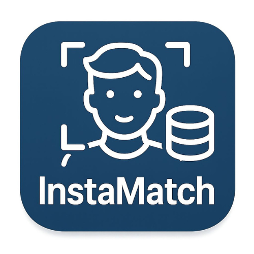

# InstaMatch - Advanced Face Recognition Attendance System




## Table of Contents
- [Overview](#overview)
- [Technical Architecture](#technical-architecture)
- [Requirements](#requirements)
  - [Dependencies](#dependencies)
  - [System Requirements](#system-requirements)
- [Common Issues and Troubleshooting](#common-issues-and-troubleshooting)
- [Learning Resources](#learning-resources)
- [Installation](#installation)
- [Usage](#usage)
  - [Running the Application](#running-the-application)
  - [Face Registration](#face-registration)
  - [Attendance Management](#attendance-management)
- [Technical Implementation](#technical-implementation)
  - [Training Process](#training-process)
  - [Recognition Process](#recognition-process)
- [Project Structure](#project-structure)
- [Contributing](#contributing)
- [License](#license)
- [Contact](#contact)

## Known Limitations
- Recognition accuracy may decrease in poor lighting conditions.
- Requires a high-quality webcam for optimal performance.
- Limited to local storage unless MongoDB is configured.

## Overview
InstaMatch is a sophisticated facial recognition attendance system built with OpenCV. It automatically records attendance with high accuracy by capturing and processing faces from multiple angles and lighting conditions, storing records in both CSV files and MongoDB.

## Technical Architecture

### Computer Vision Pipeline
- **Face Detection**: Multi-angle detection using cascades for frontal and profile faces
- **Face Recognition**: LBPH (Local Binary Patterns Histograms) face recognition with optimized parameters
- **Image Processing**: Histogram equalization, rotation normalization, and perspective transforms
- **Data Augmentation**: Runtime generation of training variations from single reference images

### Data Storage
- **Local Storage**: Date-stamped CSV files in the attendance directory
- **Database**: MongoDB integration for scalable attendance records with confidence metrics
- **Environment Configuration**: Configurable database connection via `.env`

### Performance Features
- **Real-Time Processing**: Optimized frame processing for low-latency recognition
- **Confidence Thresholding**: Adaptive recognition thresholds with stability counters
- **Cooldown System**: Smart duplicate prevention with configurable timing
- **Error Handling**: Robust exception management across the recognition pipeline

## Requirements

### Dependencies
```bash
pip install -r requirements.txt
```

Required packages:
- opencv-python
- opencv-contrib-python
- numpy
- pymongo
- python-dotenv

### System Requirements
- Python 3.7+
- Webcam or compatible camera device
- 4GB RAM minimum (8GB recommended)
- MongoDB (optional for database features)

## Common Issues and Troubleshooting

### 1. OpenCV Installation Errors
- **Issue**: Errors while installing `opencv-python` or `opencv-contrib-python`.
- **Solution**: Ensure you have the latest version of `pip`:
  ```bash
  python -m pip install --upgrade pip
  ```
  Then retry installing the dependencies.

### 2. MongoDB Connection Issues
- **Issue**: Unable to connect to MongoDB.
- **Solution**:
  - Verify MongoDB is running on your system.
  - Check the `MONGODB_URL` in the `.env` file for typos.
  - Test the connection using a MongoDB client tool.

### 3. Webcam Not Detected
- **Issue**: The application cannot access the webcam.
- **Solution**:
  - Ensure no other application is using the webcam.
  - Check if the webcam drivers are installed and up-to-date.
  - Use an external USB camera if the built-in camera is not working.

### 4. Poor Recognition Accuracy
- **Issue**: Faces are not recognized accurately.
- **Solution**:
  - Ensure training images are clear and well-lit.
  - Add more images for each person from different angles.
  - Avoid using low-resolution or blurry images.

### 5. Python Version Compatibility
- **Issue**: Errors due to incompatible Python version.
- **Solution**: Use Python 3.7 or higher. Check your version with:
  ```bash
  python --version
  ```

## Learning Resources

### Python and OpenCV
- [OpenCV Python Tutorials](https://docs.opencv.org/4.x/d6/d00/tutorial_py_root.html)
- [Python Official Documentation](https://docs.python.org/3/)

### MongoDB
- [MongoDB Basics](https://www.mongodb.com/docs/manual/introduction/)
- [Python MongoDB Driver (PyMongo)](https://pymongo.readthedocs.io/en/stable/)

### Face Recognition
- [LBPH Face Recognition Explained](https://towardsdatascience.com/face-recognition-how-lbph-works-90ec258c3d6b)
- [Histogram Equalization](https://en.wikipedia.org/wiki/Histogram_equalization)

### Git and GitHub
- [Git Basics](https://git-scm.com/doc)
- [GitHub Guides](https://guides.github.com/)

## Installation

1. **Clone the repository**:
   ```bash
   git clone https://github.com/NabarupDev/InstaMatch.git
   cd InstaMatch
   ```

2. **Install dependencies**:
   ```bash
   pip install -r requirements.txt
   ```

3. **Configure database** (optional):
   - Install MongoDB if using database features
   - Create/modify `.env` file with your connection details:
     ```
     MONGODB_URL=mongodb://localhost:27017/
     DATABASE_NAME=attendance_db
     COLLECTION_NAME=attendance_records
     ```

4. **Prepare training data**:
   - Create a `known_faces` directory
   - Add clear face images named after each person (e.g., `john_smith.jpg`)
   - Best practice: Include at least 2-3 images per person from different angles

## Usage

### Running the Application
```bash
python main.py
```

### Face Registration
1. Add clear, well-lit face images to the `known_faces` directory
2. Name each file with the person's name (e.g., `firstname_lastname.jpg`)
3. Restart the application to retrain the model

### Attendance Management
- Attendance is automatically saved to `attendance/attendance_YYYY-MM-DD.csv`
- MongoDB records include additional metadata (confidence scores, camera IDs)
- Each person is only recorded once per day regardless of multiple detections

## Technical Implementation

### Training Process
1. Face images are loaded and processed from the `known_faces` directory
2. Multi-angle face detection is applied to each image
3. Advanced data augmentation generates variations with different:
   - Lighting conditions (brightness/contrast adjustments)
   - Angles (±15° rotations in 5° increments)
   - Perspectives (simulated head tilts)
   - Horizontal flips (for profile recognition)
4. The LBPH face recognizer is trained with these processed variations

### Recognition Process
1. Video frames are captured from the webcam in real-time
2. Each frame is converted to grayscale and enhanced with histogram equalization
3. Faces are detected using cascades for both frontal and profile angles
4. Detected faces undergo the same preprocessing as training images
5. Multiple recognition attempts are made with slight rotations for angle tolerance
6. Confidence thresholds and stability counters ensure reliable identification
7. Attendance is marked when recognition confidence and stability criteria are met

### Project Structure
```
InstaMatch/
├── attendance/          # Attendance CSV records by date
├── known_faces/         # Training images for face recognition
├── main.py              # Core application logic
├── requirements.txt     # Python dependencies
├── README               # Project documentation
├── .env                 # Environment variables (MongoDB credentials)
├── .env.example         # Example environment configuration
└── LICENSE              # MIT License
```

## Contributing
We welcome contributions to enhance InstaMatch:

1. Fork the repository
2. Create a feature branch (`git checkout -b feature/amazing-feature`)
3. Implement your changes with appropriate tests and documentation
4. Commit your changes (`git commit -m 'Add amazing feature'`)
5. Push to the branch (`git push origin feature/amazing-feature`)
6. Open a Pull Request

## License
This project is licensed under the MIT License - see the [LICENSE](LICENSE) file for details.

## Contact

Project maintainer: [nabaruproy.dev@gmail.com](mailto:nabaruproy.dev@gmail.com)

---
© 2025-2026 Nabarup Roy
